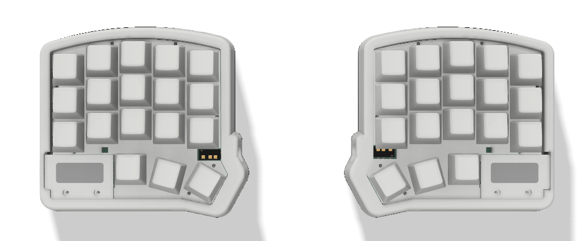
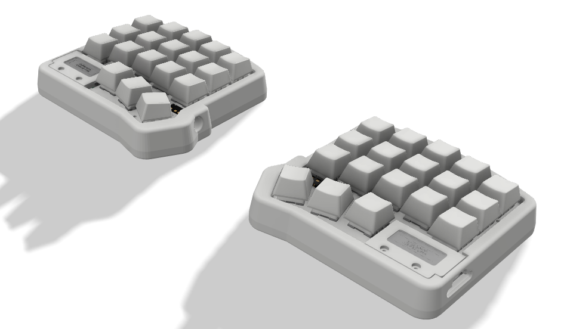
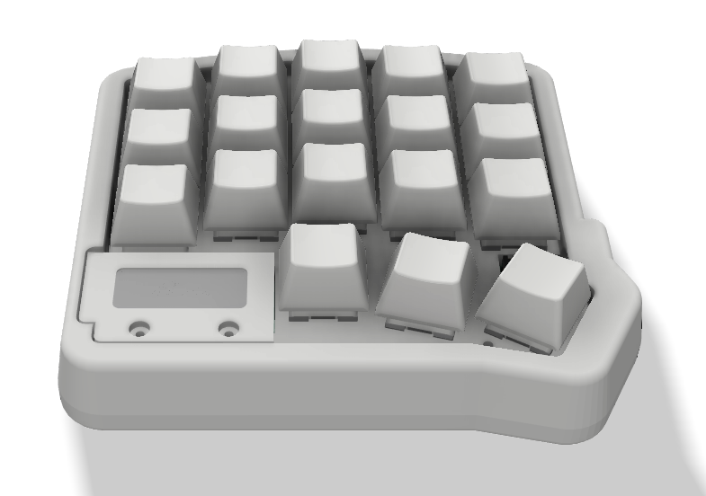
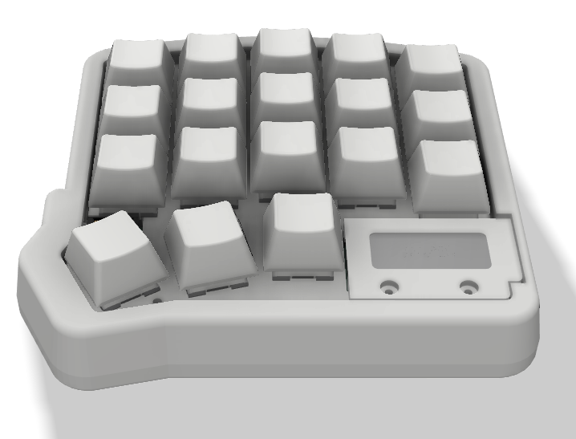

# Minikeeb
a split keyboard mini based on microdox and microredox using MX Style Switch 

## Table of Content
* [Product Specsification](#product-specsification)
* [Download VIA](#download-via)
* [Load JSON File](#Load-JSON-File)
* [Link Keycode QMK](#Link-keycode-qmk)
* [Tutorial VIA Usage](#tutorial-via-usage)
* [Cara Setting Knob](#cara-setting-knob)
* [How To use MACRO](#how-to-use-macro)
* [Preview Hardware](#preview-hardware)
* [Preview VIA](#preview-via)
* [Cara Update/Upgrade Firmware](#cara-update/upgrade-firmware)
* [Documentation](#documentation)
  * [Pinout Diagram](#pinout-diagram)
  * [Dimension](#dimension)
  * [BOM](#bom)
  * [Schematic](#schematic)
  * [Example Program](#examples-program)
* [FAQ](#FAQ)

## Product Specsification
- Arduino Pro Micro Type C as Microcontroller
- QMK Firmware
- Support VIA, all key and knob can proggrammed
- RGB per Keys
- 4x Layer 
- Hotswap Switch
- 3D Case 

## Download VIA
Link Download VIA(CHOSEE BASED YOUR OS) : https://github.com/the-via/releases/releases
VIA WEB VERSION : https://usevia.app/

## Link Keycode QMK
- mouse : https://github.com/qmk/qmk_firmware/blob/master/docs/feature_mouse_keys.md
- keyboard : https://github.com/qmk/qmk_firmware/blob/master/docs/keycodes.md

## Tutorial VIA Usage
- https://docs.keeb.io/via

## Cara Setting Knob
- Untuk melakukan setting di knob perlu memasukan command berupa keycode qmk, Jadi cara nya sama dengan melakuykan setting dengan Any key seperti petunjuk pada link berikut: 
https://docs.keeb.io/via

Here's some examples:

- LALT(KC_TAB) - Sends Alt-Tab
- LCTL(KC_C) - Sends Ctrl-C
- LGUI(KC_C) - Sends Cmd-C or Win-C
- LSFT(LCTL(KC_END)) - Sends Shift-Ctrl-End
- MO(1) - Momentarily turn on layer 1
- LCA(KC_DEL) - Sends Ctrl-Alt-Del
- MT(MOD_RSFT, KC_ENT) - Sends Shift if held, Enter if tapped
- MACRO (0) - macro 0

## How To use MACRO
you can read on [this file](https://github.com/juarendra/STREAMPAD-QMK-VIA/blob/main/DOC/MACRO%20VIA%20USAGE.pdf)
or you can read on this [web](https://www.keychron.com/blogs/archived/how-to-use-via-to-program-your-keyboard)
or you can see video [youtube](https://youtu.be/GtSeo69Y0Zw)

## Preview Hardware

  
  
  
  

## Preview VIA

https://github.com/juarendra/Zeapad-Pro-QMK-VIA/assets/43043633/afd7e68e-0a54-4b18-be12-b96c0f13611a

## Cara Update/Upgrade Firmware
- Siapkan dahulu Keyboard minikeeb, kabel usb dan firmware yang ingin di update/upgrade ke keyboard anda anda
- Anda perlu melakukan flashing di masing masing sisi keyboard (kanan dan kiri)
- Siapkan Firmware yang akan digunakan untuk update/upgrade
- Download Software QMK Toolbox di [link berikut](https://github.com/qmk/qmk_toolbox/releases)
- Install Software QMK Toolbox, Install Semua drivernya. setelah siap anda dapat meload Firmware yang seblumnya. Lalu Centang Auto-Flash seperti gambar dibawah

  

- Lakukan flashing pada sisi kiri dahulu
- Pada minikeeb sisi kiri Colok kabel ujung usb type C ke keyboard tanpa mencolokannya dahulu ke USB PC anda
- Tekan dan tahan tombol yang berada di ujung atas kiri. lalu colokan Ujung USB yang sebelum ke USB PC anda sambil tetap menahan tombol sebelum nya sebentar
- Setelah ada bunyi/notif USB masuk. anda dapat melepaskan tombol/knobnya
- Maka secara otomatis macropad akan terflash. jika selesai maka tampilan QMK toolbox akan seperti gambar dibawah

  

- Lakukan flashing pada sisi kanan
- Pada minikeeb sisi kanan Colok kabel ujung usb type C ke keyboard tanpa mencolokannya dahulu ke USB PC anda
- Tekan dan tahan tombol yang berada di ujung atas kanan. lalu colokan Ujung USB yang sebelum ke USB PC anda sambil tetap menahan tombol sebelum nya sebentar
- Setelah ada bunyi/notif USB masuk. anda dapat melepaskan tombol/knobnya
- Maka secara otomatis macropad akan terflash. jika selesai maka tampilan QMK toolbox akan seperti gambar dibawah

  

## Documentation
### Pinout Diagram
### Dimension
[Dimension File](https://github.com/juarendra/Minikeeb_QMK_VIA/blob/main/HARDWARE/dimension%20minikeeb.pdf)
### BOM
### Schematic
[Schematic File](https://github.com/juarendra/Minikeeb_QMK_VIA/blob/main/HARDWARE/schematic%20minikeeb.pdf)
### Example Program
[Example Firmware]()
## FAQ
